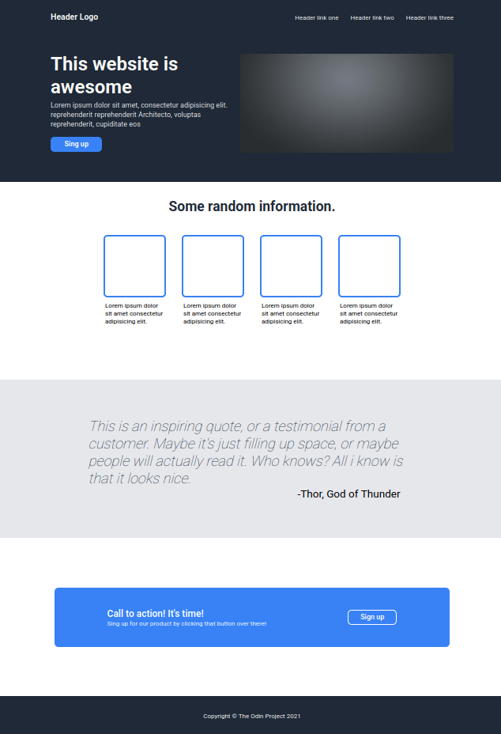

# The Odin Project 🚀

Este exercício foi proposto para treinar habilidades em **CSS** e **HTML** no [The Odin Project](https://www.theodinproject.com/). O objetivo é aprender sobre **seletores**, **propriedades** e **valores**, aprimorando o domínio dessas tecnologias. 🎨💻

## Desafio 💪

O desafio consiste em recriar uma página web com base no exemplo fornecido pelo projeto, utilizando exclusivamente **HTML** e **CSS** básicos. Durante a implementação, será necessário aplicar conhecimentos sobre a estrutura semântica do HTML, como a utilização de tags apropriadas para seções, cabeçalhos, parágrafos e links, além de manipular os estilos com CSS, ajustando propriedades como cores, fontes, margens, paddings e posicionamento de elementos. O objetivo é reproduzir o layout da página o mais fielmente possível, sem o uso de frameworks ou bibliotecas externas, desafiando o desenvolvedor a trabalhar apenas com os conceitos fundamentais de cada linguagem. Esse exercício é uma ótima oportunidade para consolidar o entendimento sobre a construção e o design de páginas web com base em boas práticas de desenvolvimento. 🖥️🎯

## Resultado 🏆

Ao completar este exercício, compreendi mais sólida sobre a construção de layouts e a aplicação de estilos em HTML e CSS. ✅

### Comparativo 🆚
 

  
  

